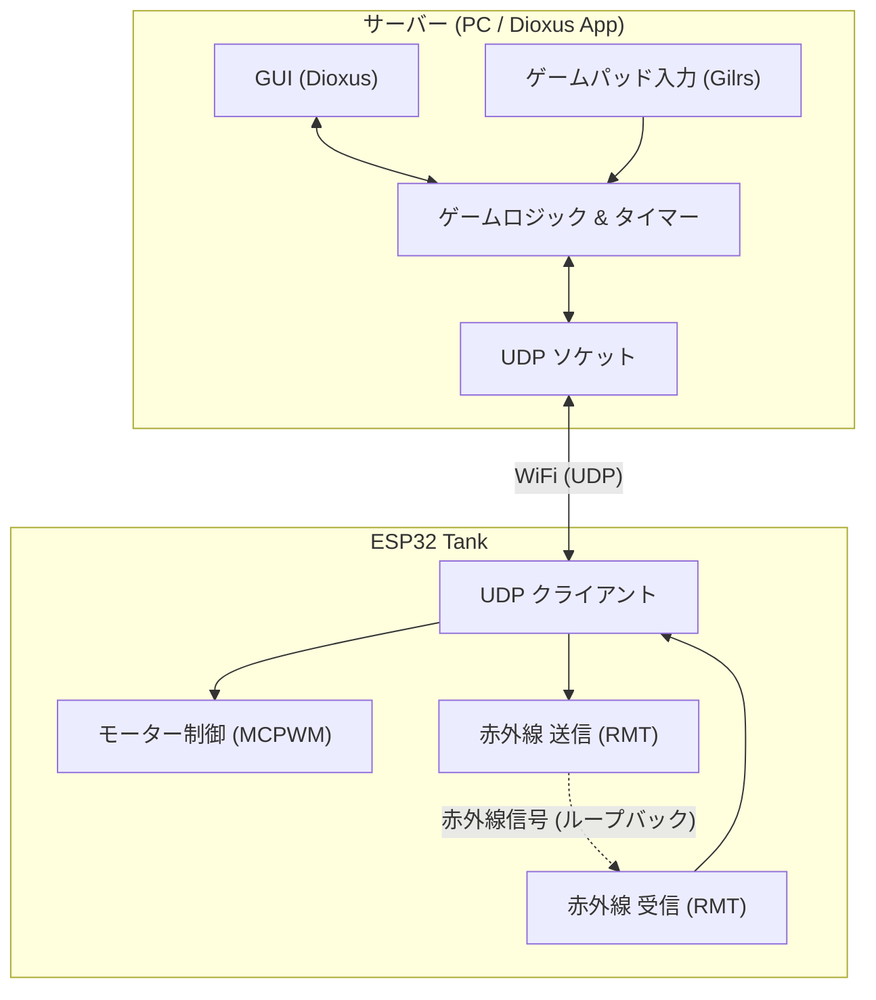

# Laser Tank

Laser Tank は、Rustで構築された2人プレイ用のレーザータグ戦車ゲームです。物理的な戦車を中央サーバーを介して制御し、Wi-Fi (UDP) 経由で通信を行います。

## プロジェクト構成

このリポジトリはCargoワークスペースとして構成されており、主に3つのコンポーネントから成り立っています：

- **`communication`**: サーバーと戦車間の通信に使用されるプロトコルやデータ構造を定義した共有ライブラリです（`postcard` と `serde` でシリアライズされています）。
- **`dx`**: DioxusベースのGUIサーバーアプリケーションです。ゲームロジックの管理、`gilrs`を使ったゲームパッド入力の処理、プレイヤーのステータス（残機、リロード時間、接続状態）の表示を行い、UDP経由でESP32の戦車と通信します。また、効果音の再生も行います。
- **`esp32`**: ESP32マイコン上で動作する戦車側のファームウェアです。`esp-hal` と `embassy` 非同期ランタイムを使用しています。モーター制御 (PWM)、着弾判定のための赤外線 (IR) 送受信 (RMT)、およびサーバーとのWi-Fi/UDP通信を処理します。

## システムアーキテクチャ



## 主な機能

- **リアルタイム制御:** サーバーに接続されたゲームパッドを使用して戦車を操作します。
- **着弾判定:** 赤外線 (IR) の送信機と受信機を使用し、対戦相手からの攻撃（着弾）を検知します。
- **動的 UI:** Dioxus製のレスポンシブなGUIにより、接続状況、残機、リロードタイマーなどのリアルタイムな統計情報を表示します。
- **非同期ファームウェア:** `embassy` を用いた堅牢なESP32ファームウェアにより、ネットワーク、モーター制御、センサーの読み取りを並行して実行します。

## セットアップと実行方法

### 必要なもの

- Rust ツールチェーン
- ファームウェアのビルドに必要な ESP-IDF / `esp-hal` の依存関係
- ゲームパッド（プレイヤー入力用）

### 環境変数

プロジェクトのルートに以下のキーを含む `.env` ファイルを作成してください：

```env
RECEIVE_PORT="[RECEIVE_PORT]"
SEND_PORT="[SEND_PORT]"
SERVER_IP="[IP_ADDRESS]"
INTERVAL="50"
SSID="[YourWiFiSSID]"
PASSWORD="[YourWiFiPassword]"
```

### サーバーの実行

```bash
cd dx
dx serve
```

### ESP32ファームウェアの書き込み

```bash
cd esp32
cargo run --release
```
