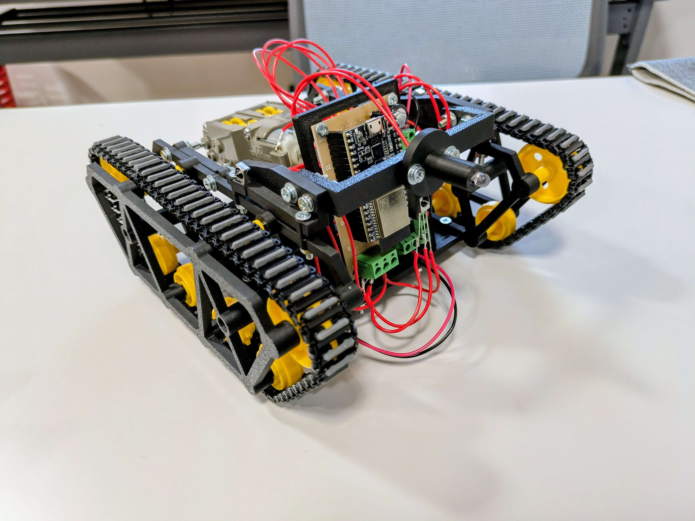
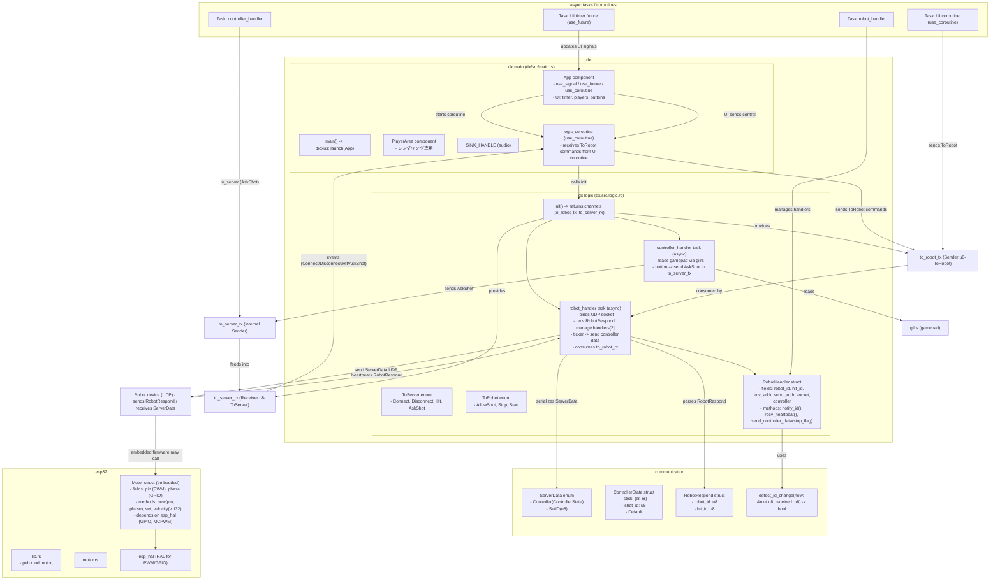

# レーザータンク

Rustで構築された、ハードウェア（ESP32）とPC上のゲームサーバー（Dioxus）が連携する2人プレイ用戦車ゲームです。
組み込みからGUI、通信プロトコルに至るまで、システム全体を **Rust** で統一して開発しています。

---

## ハードウェア仕様 (Hardware)
### 使用部品
* **MCU:** ESP32-WROOM-32E (またはお手持ちのボード)
* **モータードライバ:** [型番]
* **赤外線送信:** 赤外線LED
* **赤外線受信:** [型番]

